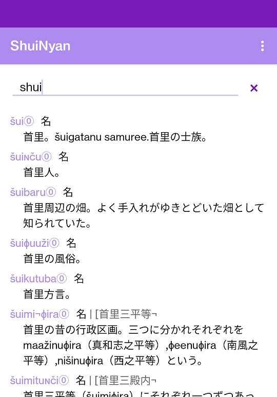

# ShuiNyan
A basic Ryukyu/Okinawan (Shui) - Japanese dictionary on android.  
Using database from 《沖繩語辞典》, digitalized by [沖縄語辞典 データ集](https://mmsrv.ninjal.ac.jp/okinawago/)  

簡易的琉日辭典（首里）  
數據來源《沖繩語辞典》，電子檔案由[沖縄語辞典 データ集](https://mmsrv.ninjal.ac.jp/okinawago/)提供  
  
  
